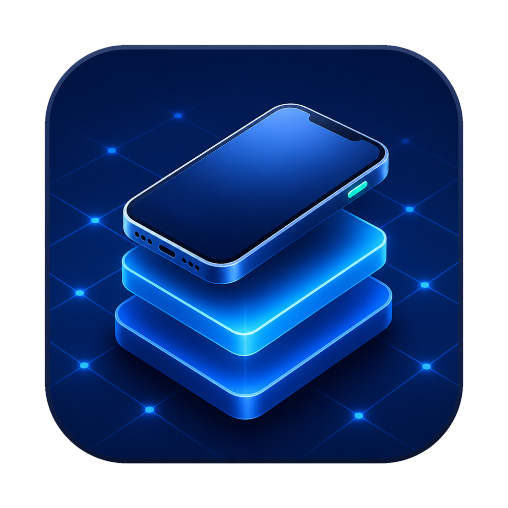

# iOS Virtual Device Lab

<p align="center">
  
</p>

A native macOS SwiftUI laboratory for virtual iOS research and cross-version app testing. It uses [`vphone-cli`](https://github.com/Lakr233/vphone-cli) as the first replaceable backend behind a typed engine API.

## Implemented MVP

- Native VM library with live running/stopped state, iOS/build metadata, disk, memory, CPU, and networking details.
- Host preflight for Apple Silicon, nested virtualization, SIP, research-guest status, backend discovery, and actual binary launchability.
- Guided end-to-end VM creation with firmware variant, disk size, optional iPhone IPSW, and optional cloudOS IPSW.
- Boot, graceful stop, clone, delete, and hardware/network configuration.
- First-class “Launch & Install” for `.ipa` and `.tipa` packages using the backend guest control channel.
- IPSW catalog that indexes firmware in place instead of duplicating large files.
- Named compressed snapshots and restores using `vphone-cli vm export/import`.
- Persistent, filterable streaming command logs with copy/export support.
- External storage support through the existing `~/.vphone` layout.
- Versioned firmware compatibility evidence, IPSW structure checks, and SHA-256 fingerprints.
- Multi-device deployment runs with screenshots and persistent per-VM results.
- Full baseline acceptance runner covering clone, boot, guest control, stop, snapshot, verify, restore, and cleanup.
- Pause/resume, cancellable operations, timeouts, disk-space guards, and snapshot integrity checks.
- Built-in automation workflows, explicit executable plugins, and diagnostic bundles.
- Versioned iPhone hardware profiles with SoC, RAM, storage, display, GPU, network modes, and supported-iOS ranges.
- Automatic IPSW/device identification, compatibility recommendations, cloudOS pairing, and creation-time enforcement.
- Configurable test assertions, reusable IPA/TIPA artifacts, Markdown/JSON reports, and an ordered workflow editor.
- Networking, audio-test, isolation, performance-monitoring, guest crash/log export, and snapshot-retention controls.
- Xcode Run Script deployment helper plus trusted, checksum-pinned plugin permissions.
- BuildManifest-based IPSW inspection that treats archive metadata—not the filename—as authoritative.
- `vdlctl` headless workflows with resource budgets, launchd scheduling, and JSON/JUnit/HTML evidence.
- Sanitized and optionally encrypted diagnostic exports, deterministic crash classification, and opt-in trusted analyzer plugins.
- Real host-process disk-I/O telemetry, runtime audio capability evidence, richer visual/log/network/resource assertions, and explicit unsupported-feature reporting.
- Developer ID/notarization/update-signing release infrastructure with verified update downloads.
- Operational-readiness dashboard with explicit acceptance gates, host compatibility evidence, migration/rollback status, and interrupted-operation recovery.
- Reproducible environment profiles, versioned guest-protocol negotiation, storage lifecycle governance, and firmware provenance.
- Sandboxed/audited plugins plus an authenticated HMAC-signed `vdlctl` queue for remote and CI execution.
- A multi-backend registry, evidence-based firmware recommendation engine, and in-app capability matrix that keeps unimplemented research adapters non-selectable.
- A versioned companion contract, Keychain-backed guest-control lifecycle, full encrypted lab recovery, launch safe mode, health-checked updater rollback, and evidence-linked real-VM qualification.
- A machine-readable third-party provenance catalog with exact pins, license/terms, source-use boundaries, modifications, obligations, and distribution status.
- A production-readiness workspace for pinned real-VM qualification, safe first-run repair, authenticated guest protocol v3, gated accessibility automation, signed/reviewed evidence, verified backup staging, remote-agent v2, transactional update/rollback commands, supply-chain attestations, and non-destructive resilience fixtures.
- A Continuity & Public Beta workspace with atomic external-storage relinking, audited crash-recovery decisions, canonical real-VM fixtures, declarative Labfiles, evidence expiry, host calibration, hostile-input tests, unified retention, measurable operational objectives, and human beta-quality gates.
- A Platform Engineering workspace with a backend-adapter SDK and conformance suite, deterministic reset plans, build/signing/symbol identities, sanitized failure replay bundles, flakiness/regression analysis, multi-Mac placement, correlated run timelines, a formal threat/secrets inventory, deterministic fuzz and coverage gates, and staged beta feedback operations.
- A Qualification & Scale workspace with evidence-derived maturity, approved real-VM compatibility publication, checksum-pinned executable adapters, authenticated guest automation, validated replay execution, UUID-verified symbolication, fleet leases/heartbeats, monotonic timelines, machine-readable coverage import, and capability-aware virtual/physical routing.
- A Production Depth workspace with build/install/upgrade/rollback for hash-pinned guest companions, signing/provisioning inspection, exclusive physical-device leases, visual/accessibility regression, typed network/audio faults, pinned mTLS fleet enrollment, SQLite/WAL event storage, exact-tuple upgrade certification, immutable CI action checks, and bundled recovery drills.
- A fail-closed v1 Completion workspace covering the support contract, concrete guest companion, real-VM acceptance and version matrix, live macOS UI automation, verified fault cleanup, an mTLS/RBAC fleet coordinator, reliability campaigns, a coverage ratchet, and signed release exit evidence.

## Requirements

- Apple Silicon Mac running macOS 15 or later.
- Homebrew `vphone-cli` or a local signed build.
- The backend’s required Recovery-mode configuration.
- For the minimal host-policy option:

  1. In Recovery Terminal: `csrutil enable --without debug`
  2. In Recovery Terminal: `csrutil allow-research-guests enable`
  3. Back in macOS: `vphone-amfidont`

The lab remains usable as a read-only library and diagnostics viewer before preflight passes, but backend mutations and VM launch are intentionally blocked.

## Build and run

```sh
git clone https://github.com/elliot7williams/ios-virtual-device-lab.git
cd ios-virtual-device-lab
./scripts/build_app.sh
open ".build/iOS Virtual Device Lab.app"
```

For development:

```sh
swift build
swift test
swift run IOSVirtualDeviceLab
swift run vdlctl --help
swift run vdlctl labfile plan --file Labfile.json
swift run vdlctl adapter check --manifest adapter-manifest.json
swift run vdlctl platform status --json
swift run vdlctl expansion status --json
swift run vdlctl depth status --json
swift run vdlctl completion status
swift run vdl-ui-smoke --help
swift run vdl-fleetd --help
swift run vdlctl targets list --json
```

Homebrew and `/Applications/vphone-cli.app` installations are discovered automatically. For a local backend build, set `VPHONE_CLI_BIN` to its executable and, if needed, `VPHONE_VPHONED_PATH` to `vphoned.signed` before launching the manager.

To regenerate the macOS `.icns` bundle from the checked-in 1024 px master:

```sh
./scripts/build_icon.sh
```

To create a versioned ZIP and checksum:

```sh
./scripts/release_app.sh 0.13.0
```

Developer ID signing and notarization are supported through `CODE_SIGN_IDENTITY` and `NOTARYTOOL_PROFILE`; see [Release engineering](docs/RELEASES.md).

## Storage

The default layout follows the backend:

```text
~/.vphone/
├── VMs/                  virtual-device bundles
├── ipsws/                downloaded/imported firmware cache
├── Snapshots/            compressed named restore points
└── VirtualDeviceLab/     profiles, app builds, test reports, diagnostics, plugins, and activity
```

To keep multi-gigabyte firmware and VM disks off the internal system volume, `~/.vphone` may be symlinked to a dedicated directory on an external APFS volume. Continuity & Beta records the volume identity, detects stale links without recreating missing storage, and can atomically relink a stopped lab to an existing dedicated directory.

## Safety behavior

- Snapshot creation and hardware edits require a stopped VM.
- VM and snapshot deletion require explicit confirmation.
- Forgetting an imported IPSW removes only its catalog record; it never deletes the source firmware.
- VM creation uses the backend’s native authentication dialog rather than storing a sudo password.
- The manager never weakens SIP/AMFI itself.

See [Architecture](docs/ARCHITECTURE.md), [Backend API](docs/BACKEND_API.md), [v1 completion](docs/V1_COMPLETION.md), [Production depth](docs/PRODUCTION_DEPTH.md), [Platform engineering](docs/PLATFORM_ENGINEERING.md), [Qualification and scale](docs/QUALIFICATION_AND_SCALE.md), [Operational readiness](docs/OPERATIONAL_READINESS.md), [Continuity and beta](docs/CONTINUITY_AND_BETA.md), [Production readiness v2](docs/PRODUCTION_READINESS_V2.md), [Production readiness v3](docs/PRODUCTION_READINESS_V3.md), and [Roadmap](docs/ROADMAP.md) for design boundaries and the older-iOS research track.

Also read [Compatibility](docs/COMPATIBILITY.md), [Multi-backend and attribution](docs/MULTI_BACKEND_AND_ATTRIBUTION.md), [Limitations](docs/LIMITATIONS.md), [Remote agent](docs/REMOTE_AGENT.md), and [Plugin development](docs/PLUGINS.md). An entry marked `researching` or `unverified` is never a support claim.
